# **Traffic Sign Recognition (by TensorFlow) - Writeup** 
---

**Build a Traffic Sign Recognition Project**

The goals / steps of this project are the following:
* Load the data set (see below for links to the project data set)
* Explore, summarize and visualize the data set
* Design, train and test a model architecture
* Use the model to make predictions on new images
* Analyze the softmax probabilities of the new images
* Summarize the results with a written report

[//]: # (Image References)

[image1]: ./examples/visualization.jpg "Visualization"
[image2]: ./examples/grayscale.jpg "Grayscaling"
[image3]: ./examples/random_noise.jpg "Random Noise"
[image4]: ./examples/placeholder.png "Traffic Sign 1"
[image5]: ./examples/placeholder.png "Traffic Sign 2"
[image6]: ./examples/placeholder.png "Traffic Sign 3"
[image7]: ./examples/placeholder.png "Traffic Sign 4"
[image8]: ./examples/placeholder.png "Traffic Sign 5"

---
### Writeup / README
Please refer "Traffic_Sign_Classifier.ipynb" in this repository. An html file containing the code along with output for a complete run is also included (Traffic_Sign_Classifier.html).
### Data Set Summary & Exploration

#### 1. Provide a basic summary of the data set. In the code, the analysis should be done using python, numpy and/or pandas methods rather than hardcoding results manually.

Use the len() function to determine size of training, validation, and test sets, and the shape attribute to determine individual image shape on pandas library to calculate summary statistics of the traffic,

Signs data set:
The size of training set is 34799.
The size of the validation set is 4410.
The size of test set is 12630.
The shape of a traffic sign image is 32x32x3.
The number of unique classes/labels in the data set is 43.

#### 2. Include an exploratory visualization of the dataset.

Please refer to heading Include an exploration visualization in the html output. A sample image from the training set is shown along with its label including histogram of the number of images of each type in each set is shown for all three sets. 
Some sign types are underrepresented, although the distribution of sign types in the training, validation, and test sets is surprisingly similar.

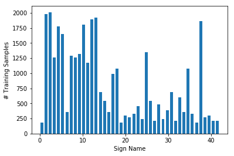

### Design and Test a Model Architecture

#### 1. Describe how you preprocessed the image data. What techniques were chosen and why did you choose these techniques? Consider including images showing the output of each preprocessing technique. Pre-processing refers to techniques such as converting to grayscale, normalization, etc. (OPTIONAL: As described in the "Stand Out Suggestions" part of the rubric, if you generated additional data for training, describe why you decided to generate additional data, how you generated the data, and provide example images of the additional data. Then describe the characteristics of the augmented training set like number of images in the set, number of images for each class, etc.)

No consider converting to grayscale due to its removing information then normalized the data by converting to 32-bit floating point listed below,

f128 = np.float32(128)
X_train_unaugmented = (X_train_uint8.astype(np.float32)-f128)/f128

For generating additional data, I wrote the function to take an image from the normalized test set, rotate it by a small amount using scipy.ndimage.interpolation.rotate(), and add a small amount of random noise using np.random.normal. Wrapped this function in a loop that appended data to the training set such that images of each label were represented. Labels to augment, and the number of augmented images to add to each label, were chosen using the histogram of each label computed earlier. For a given label, each augmented image was added by first selected a random image from the original (unaugmented) data, then applying the rotation+random noise function to it.

The total size of the original including its augmented training set was precomputed, and storage preallocated.

Please refer to heading Add augmented images such that each sign type has multiple examples in the html output for more information.

#### 2. Describe what your final model architecture looks like including model type, layers, layer sizes, connectivity, etc.) Consider including a diagram and/or table describing the final model.

My final model consisted of the following layers:

| Layer         		|     Description	        					| 
|:---------------------:|:---------------------------------------------:| 
| Input         		| 32x32x3 RGB image   							| 
| Convolution 5x5   | 1x1 stride, valid padding, outputs 28x28x6 	|
| RELU					|												|
| Dropout					|	 Externally tunable keep_prob					    |
| Max pool	      	| Size 2x2, strides 2x2, valid padding, outputs 14x14x6				|
| Convolution 5x5	    | Stride 1, valid padding.  Outputs 10x10x16   						|
| RELU					|												|
| Dropout					|	 Externally tunable keep_prob					    |
| Max pool	      | Size 2x2, strides 2x2, valid padding, outputs 5x5x16				|
| Flatten		| Input 5x5x16, output 400					|
| Fully connected	| Input 400, output 120       |
| RELU					|												|
| Dropout					|	 Externally tunable keep_prob					    |
| Fully connected	| Input 120, output 84								|
| RELU					|												|
| Dropout					|	 Externally tunable keep_prob					    |
|	Fully connected	|	 Input 84, output 43 (labels)	|

The keep_prob parameter was identical for all dropout layers 

#### 3. Describe how you trained your model. The discussion can include the type of optimizer, the batch size, number of epochs and any hyperparameters such as learning rate.

Used an Adams optimizer with the following hyperparameters:
1. EPOCHS = 40
2. BATCH_SIZE = 128
3. learning-rate = 0.001
4. dropout = .75  # keep_prob for dropout layers
#### 4. Describe the approach taken for finding a solution and getting the validation set accuracy to be at least 0.93. Include in the discussion the results on the training, validation and test sets and where in the code these were calculated. Your approach may have been an iterative process, in which case, outline the steps you took to get to the final solution and why you chose those steps. Perhaps your solution involved an already well known implementation or architecture. In this case, discuss why you think the architecture is suitable for the current problem.

First to train the model, I started from LeNet because of simplicity of implementation and there is rich information realted to it from inernet on class recognition. After running with this architecture the model tended to overfitting in validation set (training error converged to 99% while the validation error wasn`t giving a satisfactory performance). I tried to sue dropout and data augmentation to reduce overfiting. For dropout, I used doptout from 0.5 to 0.75 then saw slow down of overfitting and achieved a slightly high accuracy in uts result. With augmented dataset I saw much increased performance on my model but also worked well on the validation set. It seesm to be worth to investgate its relashtionship between dropout and data aurgrmntation but need more computing furthur. 

My final model results were:
* training set accuracy of 99.9%
* validation set accuracy of 96.2%
* test set accuracy of 95.2%

Unfortunately, it appears never to be observed validation set accuracy of greater than 96.2%, although the accuracy on the test set climbed to 99.9% (overfitting again!).

I tried training with several values of keep_prob ranging from .6 to .95, and surveied that keep_prob = 0.75 consistently delivered around 96% validation accuracy. I couldn't get it much higher than that or need more time to do research for it.

### Test a Model on New Images

#### 1. Choose five German traffic signs found on the web and provide them in the report. For each image, discuss what quality or qualities might be difficult to classify.

Here are five German traffic signs that I found on the web:
1. Bicycle crossing challenges: Writing across sign + white bar at bottom might be interpreted as a feature

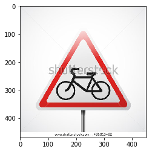

2. No passing challenges: Rotated from horizontal

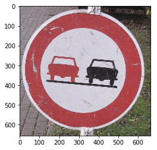

3. Turn straight or right challenges: Writing, X across sign

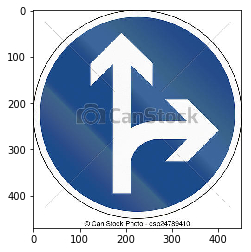

4. Road work challenges: Picture taken from low angle

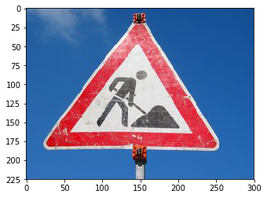

5. Children crossing challenges: Picture taken from low angle + writing across sign + white bar at bottom

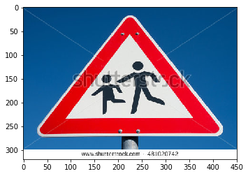

#### 2. Discuss the model's predictions on these new traffic signs and compare the results to predicting on the test set. At a minimum, discuss what the predictions were, the accuracy on these new predictions, and compare the accuracy to the accuracy on the test set (OPTIONAL: Discuss the results in more detail as described in the "Stand Out Suggestions" part of the rubric).

Here are the results of the prediction (Image's Prediction),

No entry	--> No entry

Yield	 --> Yield

No entry	---> No entry

No entry	---> No entry

Stop ---> Stop

*bicycle crossing ---> be ware of snow sign ======>wrong

Keep Right ---> Keep Right

No entry	---> No entry

*Bumpy Road ---> Speed limit (100km/h) ======>wrong

Yield	 --> Yield

The model was able to correctly guess 8 of the 10 traffic signs, which gives an accuracy of 80%. Both the bicycle crossing sign and the be ware of snow sign are red and white triangles with relatively delicate internal features containing crossed lines and circular patterns, so it is unsurprising that the network would confuse them. Also, bicycle crossing signs were relatively underrepresented in the initial (unaugmented) training set.

#### 3. Describe how certain the model is when predicting on each of the five new images by looking at the softmax probabilities for each prediction. Provide the top 5 softmax probabilities for each image along with the sign type of each probability. (OPTIONAL: as described in the "Stand Out Suggestions" part of the rubric, visualizations can also be provided such as bar charts)

The cell Output Top 5 Softmax Probabilities For Each Image Found on the Web of the jupyter notebook or html output contains code for outputting softmax probabilities for each image from the web. The top five softmax probabilities for each image are listed, along with bar charts.

INFO:tensorflow:Restoring parameters from ./lenet
Top softmax probabilities:

bicyclecrossing.jpg:

Probabilities
[ 0.56811255  0.30408615  0.07375071  0.05214828  0.00129091]

Corresponding labels
[21 30 23 29 31]

nopassing.jpg:

Probabilities
[  9.98897552e-01   6.48155867e-04   4.48003411e-04   4.67891869e-06
   1.08245683e-06]

Corresponding labels
[ 9 16 41 10  3]

straightorright.jpg:

Probabilities
[  9.99946475e-01   5.35140352e-05   3.22273985e-09   5.16274280e-11
   1.26560941e-11]

Corresponding labels
[36 35 34 40 20]

roadwork.jpg:

Probabilities
[  9.64089334e-01   3.36754173e-02   1.99340400e-03   2.05606659e-04
   1.83263073e-05]

Corresponding labels
[25 29 21 22 28]

childrencrossing.jpg:

Probabilities
[  9.99706566e-01   2.93327495e-04   1.21100044e-07   2.07563762e-08
   7.74976524e-12]

Corresponding labels
[28 29 30 23 18]

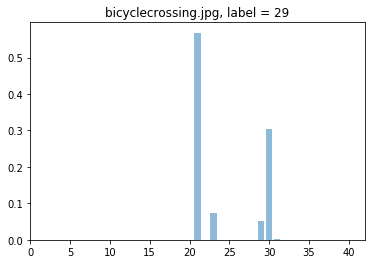

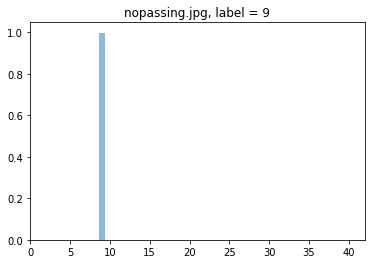

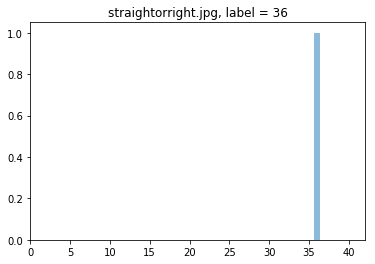

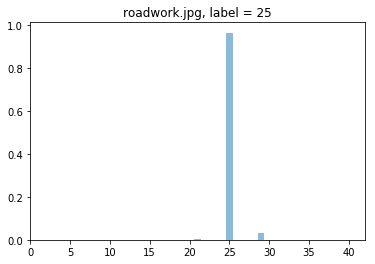

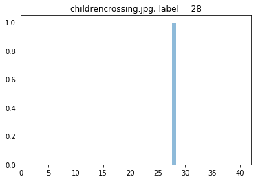

For the no passing, straight or right, and road work signs, the model is very (>99%) certain.
For the bicycle crossing sign, the network is less certain (73%) of its incorrect "Beware of ice/snow" guess. It believes the sign may also be a road work sign (13.7%) or bicycle crossing sign (9.3%).
For the children crossing sign, the model is only 52% certain, and believes the sign may be a bicycle crossing sign with 47.6% probability. This is unsurprising because these two sign types are visually similar.
(Please refer to the jupyter notebook or html output for more information).

### (Optional) Visualizing the Neural Network (See Step 4 of the Ipython notebook for more details)
#### 1. Discuss the visual output of your trained network's feature maps. What characteristics did the neural network use to make classifications?
None

